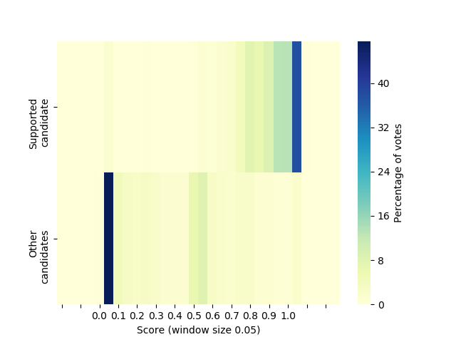
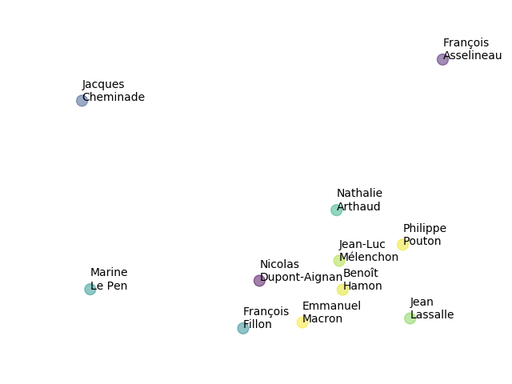

# Final project - Information visualization

Contributors:
* Chenbeh Amir
* Tuan le Van
* Borovec Ondrej

## Does the range of score used by voters depend of the candidate they support?

To solve this question we separated scores of supported candidates from others and used histogram to count score per 0.05. Then we used a heatmap to visualize these result. 
We could also use  standard distributions visualization, but we see  heatmaps are more accessible to people because it visualization is closer to the line which was used for input evaluation.

, but we also decided to use a simple distribution visualization:

In the figures we can see that candidates which were not the final picks of subjects were mostly rated around 0 and the second important point is around 0.5 which means they they did not mind them. On the other hand candiddates who had aso final support were rated with mark over 0.8 in general, which was expected.

## Which candidates are approved together?

We found out that the it is the most common that people approved two candidates as the same time with 406 samples, then there there are 290 tipples, 116 squares and so on. In case there would be just pairs, we could easily use 3d bar plot, but it would not covver te other combinations.
So we decided to count occurecy of each pair and then scale it from 0 to 1. Such distance matrix is used for T-SNE algorithm which transform the space to 2D.

Just for example we can see that the most together appoved candidates were Jean-Luc Melenchon and Benoit Hamon.
